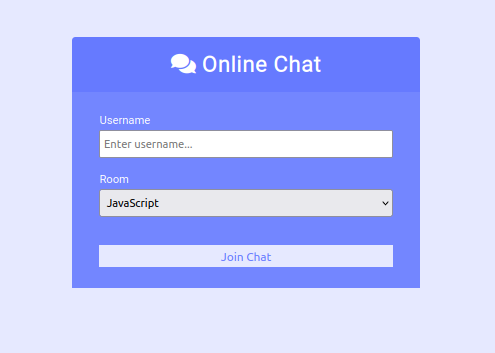
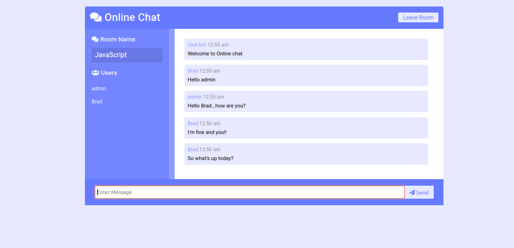

 # Online Chat

Online Chat is a web application that allows simulation of a group communication network between several members

Render






## Installation

Use the package manager [npm](https://www.npmjs.com/) to install socket.io moment express .

```bash
npm install moment socket.io express

npm install -D nodemon
```

## Usage

```js
npm run dev
```

#### Go to adress [localhost:3000](http://localhost:3000) to see the render of your app
## Contributing
Pull requests are welcome. For major changes, please open an issue first to discuss what you would like to change.

Please make sure to update tests as appropriate.

## License
OpenSource